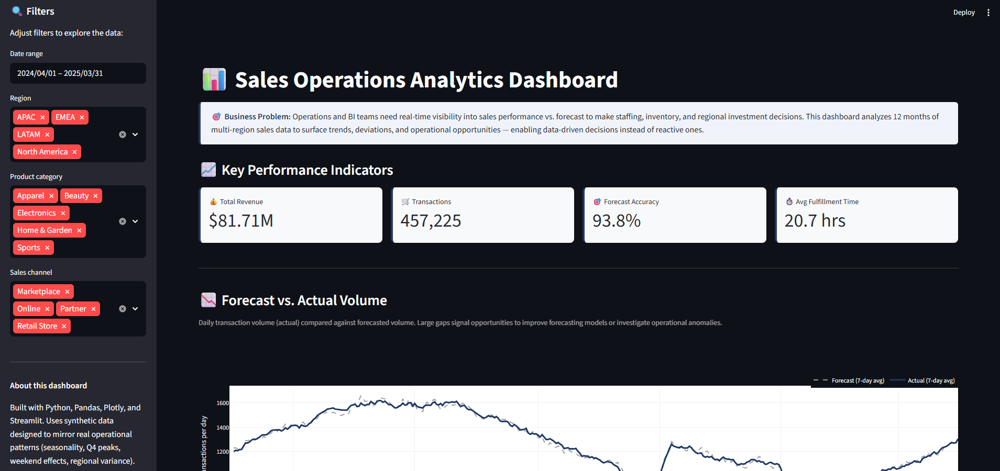

# 📊 Sales Operations Analytics Dashboard

> **Live demo:** [Link to Streamlit app — add after deploy]

An interactive analytics dashboard that helps operations and business intelligence teams track sales performance against forecast, identify regional and channel trends, and surface operational opportunities.



---

## 🎯 The Problem

Operations and BI teams need real-time visibility into sales performance vs. forecast to make staffing, inventory, and regional investment decisions. Without it, teams react to issues after they've already impacted service levels and revenue.

This dashboard answers questions like:
- Where are we over- or under-performing against forecast?
- Which regions and categories are driving revenue growth?
- When are our operational peak periods — and are we staffed for them?
- Which days had the biggest forecast misses, and what should we investigate?

## 🔍 Features

- **4 dynamic KPIs:** Total revenue, transaction count, forecast accuracy (MAPE-based), avg. fulfillment time
- **Interactive filters:** Date range, region, product category, sales channel
- **Forecast vs. Actual trend** with 7-day rolling averages
- **Revenue breakdowns** by region and category
- **Operational heatmap** showing sales intensity by weekday and channel
- **Top deviations table** highlighting days where forecast missed most — the cases ops teams should investigate first

## 🛠️ Tech Stack

- **Python** — data processing and app logic
- **Pandas / NumPy** — data transformation and aggregations
- **Plotly** — interactive visualizations
- **Streamlit** — dashboard framework
- **Streamlit Community Cloud** — deployment

## 📁 Project Structure

```
sales-ops-dashboard/
├── app.py                # Streamlit dashboard application
├── generate_data.py      # Synthetic data generator
├── data/
│   └── sales_data.csv    # Generated dataset (450K+ transactions)
├── requirements.txt
└── README.md
```

## 🚀 Run Locally

```bash
# Clone the repo
git clone https://github.com/Rivalry11/sales-ops-dashboard.git
cd sales-ops-dashboard

# Create virtual environment
python -m venv venv
source venv/bin/activate      # Mac/Linux
venv\Scripts\activate         # Windows

# Install dependencies
pip install -r requirements.txt

# Generate the dataset
python generate_data.py

# Launch the dashboard
streamlit run app.py
```

## 📊 About the Data

The dashboard uses synthetic data designed to mirror real-world operational patterns:
- **Seasonality:** Annual sine-wave demand curve with Q4 holiday peaks (40% boost)
- **Weekly effects:** Weekend bump for online behavior (+15%)
- **Growth trend:** 5% annual growth baked into the baseline
- **Regional variance:** Different base volumes reflecting real market sizes
- **Channel behavior:** Differentiated fulfillment times and pricing

The dataset contains **~450,000 transactions** across 12 months, 4 regions, 5 product categories, and 4 sales channels.

## 🎨 Design Choices

Forecast accuracy and deviation tracking are modeled after KPIs I used in Workforce Management roles, where surfacing volume vs. forecast gaps enabled real operational improvements — for example, raising agent occupancy from 20% to 65% at IntouchCX by rebalancing staffing against actual demand.

This dashboard applies that same analytical mindset — *"what's happening vs. what we expected, and what should we do about it?"* — to a broader sales operations context.

## 👤 About

**Camila Rubio Cuellar** — Business Intelligence & Data Analyst

- 🔗 [LinkedIn](https://linkedin.com/in/camila-rubio-cuellar/)
- 💻 [GitHub](https://github.com/Rivalry11)
- 📧 cam.rv1121@gmail.com

3+ years in data analytics, workforce management, and customer experience analytics at DiDi, HPE Aruba, and IntouchCX. Currently completing a Data Science bootcamp at 4Geeks Academy.

---

*Built with ❤️ using open-source tools.*
